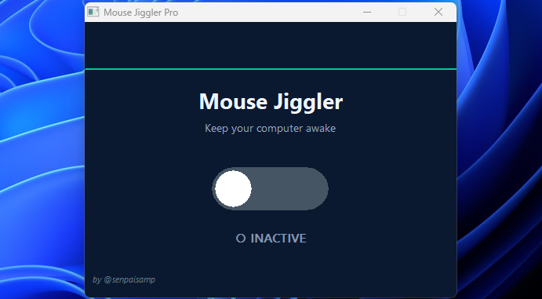

# Mouse-Jiggler

**Mouse Jiggler Pro**  
A lightweight Windows utility that simulates tiny mouse movements to prevent your computer from automatically sleeping or locking the screen.

---

## Preview

  

---

## Features

- **Smart jiggling** – Moves the mouse by 1-2 pixels every 2 seconds when active (imperceptible to you, but enough to keep the system awake)
- **iOS-style toggle** – Clean, animated switch with hover effects
- **Navy blue theme** – Modern, dark UI that's easy on the eyes
- **Real-time status** – Clear visual feedback when active/inactive
- **Minimal resource usage** – Built with native Win32 API, no dependencies

---

## How it works

When activated, the program sends tiny, random mouse movements (between -1 and +1 pixels) at regular intervals. This simulates user activity, preventing screensavers, sleep modes, or auto-lock features from activating.

---

## Use cases

- Preventing your work PC from locking during long processes
- Keeping remote desktop sessions alive
- Avoiding idle timeouts in applications
- Maintaining "active" status in chat or collaboration tools

---

## Requirements

- Windows 8 / 10 / 11
- No installation required – single executable
